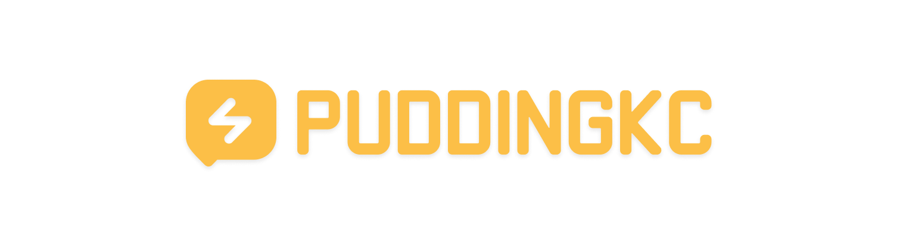

<p align="center"></p>

<p align="center">
  <b>Developer · Creator · Builder</b><br>
  <sub>I like making small things that feel nice to use.</sub>
</p>

### 🍮 About Me

``` yaml
  name: PuddingKC
  website: "https://www.puddingkc.com/"
  afdian: "https://afdian.com/a/puddingkc"

  interests:
    - Minecraft
    - VRChat
    - Blockbench
    - Creative Tools
    - Web Development

  motto: "愿你所热爱的依旧不减当年。"
```

<p align="center"></p>

### 💞 Tech Stack

[](#)
[](#)

[](#)
[](#)
[](#)
[](#)
[](#)

### 🛠️ Workflow
[](#)
[](#)
[](#)
[](#)

<p align="center"></p>

<p align="center">
  <sub>Thanks for stopping by ✨</sub><br><br>
</p>

<!--
**Null-K/Null-K** is a ✨ _special_ ✨ repository because its `README.md` (this file) appears on your GitHub profile.

Here are some ideas to get you started:

- 🔭 I’m currently working on ...
- 🌱 I’m currently learning ...
- 👯 I’m looking to collaborate on ...
- 🤔 I’m looking for help with ...
- 💬 Ask me about ...
- 📫 How to reach me: ...
- 😄 Pronouns: ...
- ⚡ Fun fact: ...
-->
